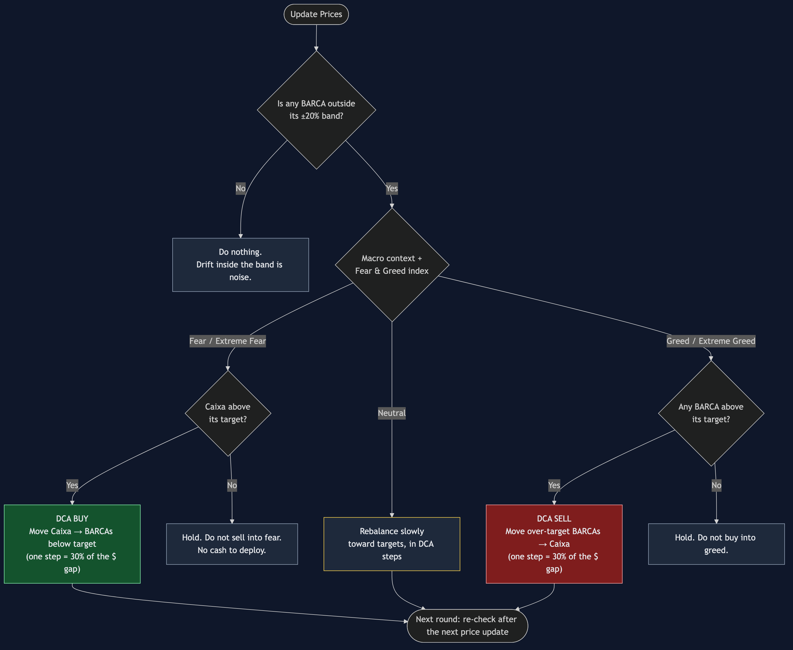

# The BARCA model

This app exists to run one investment discipline: the **BARCA model**. This
document explains the *business* side, meaning what the model is, why it
works and how to act on it. [README.md](README.md) covers the technical side.

> **BARCA is a long-term investor strategy.** It is not meant for day trading
> or even swing trading. Those could be built on the same ideas, but they
> would be hard to maintain when holdings are spread across many sources
> (wallets, exchanges, brokers), as they are here.

> This describes the portfolio owner's own strategy, as the app implements
> it. It is not financial advice.

---

## 1. What BARCA is

**BARCA** names the five pillars of the strategy. Four of them are
**buckets** of the wallet, each with a **target percentage** of the total
value (the targets add up to 100%). The fifth is a discipline.

| Letter | Stands for | In this wallet (BARCA name in the app) | Role |
|---|---|---|---|
| **B** | **Base**: core investment | `Base`: BTC | The long-term core position the whole wallet is built around. |
| **A** | **Alternative** | `Altcoins`: other crypto assets (Holding + DeFi) | Higher-risk, higher-upside satellite. In crypto this means altcoins; in a regular stock market it could be small caps. |
| **R** | **Recurrent income** (revenue) | `RendaPassiva`: FIIs (Brazilian real-estate funds) | Income the portfolio pays out on a regular basis. It is the key to a withdrawal strategy, for retirement or for anyone living off the portfolio: you spend the income, not the principal, so the portfolio keeps growing. |
| **C** | **Cash** | `Caixa`: USDT (stablecoin) | Money available to buy when opportunities appear, and where profits go when taken. **Not** an emergency fund for personal expenses; that belongs outside this wallet. |
| **A** | **Aprender** (Portuguese for "to learn") | *Not a wallet bucket* | Keep learning about the financial market: new strategies, backtests, anything investment-related. Knowledge is what keeps emotional reactions out of decisions. |

Current targets for the four wallet buckets (`BullMarket` profile):

| Base | Altcoins | RendaPassiva | Caixa |
|---|---|---|---|
| 50% | 10% | 10% | 30% |

Each asset also has its own target (Portfolio Targets tab). An asset's target
is its share **inside** the whole wallet, so the asset targets of one BARCA
should add up to that BARCA's target. Example: every asset in *Altcoins*
together should add up to 10%.

### Market profiles

The right mix of risk depends on the market cycle, so BARCA targets are saved
per **market profile**: `BullMarket` and `BearMarket`. The active profile is
set with `CURRENT_MARKET` in `.env`. Switching profile changes every BARCA
target at once, without touching the holdings. In a bear market, for
example, the profile would typically hold more Caixa and fewer Altcoins.

Changing profile is a deliberate, rare decision, based on the macro and cycle
analysis in section 3. It is not a reaction to a single day's price move.

---

## 2. Why a model instead of instinct

The model decides *when* and *how much*, so emotions don't.

- **No emotional trades.** Panic selling in a crash and FOMO buying in a
  rally are the two most expensive habits in investing. The model turns both
  moments into their opposite: buy when others panic, sell when others are
  euphoric.
- **No trading on support and resistance.** Decisions come from the wallet's
  own balance, not from guessing whether a chart level will hold. You don't
  need to predict the bottom or the top.
- **Never all-in, never all-out.** Every action moves the wallet a *step*
  toward its targets. There is always some Caixa to buy with, and always some
  Base that keeps compounding.
- **Knowledge beats reflexes.** The last A, *Aprender*, is part of the
  model on purpose: the better you understand the market, the easier it is
  to follow the rules when they feel uncomfortable.
- **Rebalancing works mechanically.** Selling what went up (above target) and
  buying what went down (below target) is "buy low, sell high", enforced by
  arithmetic. Over the long term, a disciplined balanced wallet tends to beat
  attempts to time the market.

---

## 3. The rules

Source: [`docs/barca-decision.mmd`](docs/barca-decision.mmd)

### Rule 1: act only when a BARCA crosses its ±20% band

Small drifts are noise; trading on them only adds fees and stress. A BARCA
needs attention only when its current share moves more than **20% of its own
target** away from that target:

| BARCA | Target | Band (target ± 20% of target) |
|---|---|---|
| Base | 50% | 40% – 60% |
| Caixa | 30% | 24% – 36% |
| Altcoins | 10% | 8% – 12% |
| RendaPassiva | 10% | 8% – 12% |

The band is **relative** on purpose. Drifting 2 points means little for a 50%
bucket, but it is a 20% miss for a 10% bucket.

### Rule 2: the market context decides the direction

When a band is crossed, look at the context before acting: the **macro
financial analysis** (interest rates, liquidity, cycle phase) and the
**market sentiment**, mainly the **Fear & Greed index**.

| Sentiment | What the crowd is doing | What BARCA does |
|---|---|---|
| **Extreme Fear / Fear** | Panic selling | If **Caixa is above its target**, start a **DCA buy**: move Caixa into the BARCAs that are below target, Base first. If Caixa is at or below target, just hold. Never sell into fear. |
| **Neutral** | Nothing special | Rebalance slowly toward the targets, in DCA steps. |
| **Greed / Extreme Greed** | Euphoric buying | **Time to sell, not to buy.** DCA-sell the BARCAs that are above target and move the proceeds into Caixa. Never buy into greed. |

Strong market moves (crashes and euphoric rallies) are exactly when the
wallet drifts out of balance *and* when sentiment is at an extreme. That is
why the biggest rebalancing opportunities appear there.

### Rule 3: move in DCA steps, never in one shot

Rebalancing is spread over several rounds (Dollar-Cost Averaging), so a
single bad entry price can't hurt much. The app suggests each step as **30%
of the current $ gap** to target (the **DCA** column):

| Round | Step | Gap left after the step |
|---|---|---|
| 1 | 30% of the gap | 70% |
| 2 | 30% of what is left | 49% |
| 3 | 30% of what is left | 34% |
| 6 | 30% of what is left | 12% |

Each step is smaller than the one before. If the market keeps moving in the
same direction, the next round (after the next **Update Prices**) sees a
bigger gap again, and the model automatically buys or sells a bit more.

---

## 4. Worked examples

Wallet of **$100,000**, BullMarket targets.

### A) Crash with Extreme Fear (index at 15)

| BARCA | Value | Current | Band | Status |
|---|---|---|---|---|
| Base | $38,000 | 38% | 40–60% | **below** |
| Caixa | $40,000 | 40% | 24–36% | **above** |
| Altcoins | $9,000 | 9% | 8–12% | ok |
| RendaPassiva | $13,000 | 13% | 8–12% | above |

Sentiment is extreme fear and Caixa is above its target, so it's time to
**DCA buy**. Base is $12,000 below its $50,000 target; step 1 moves **$3,600**
(30% of $12,000) from Caixa into BTC. Repeat on the next rounds while the
fear lasts and Base stays below its band.

### B) Rally with Extreme Greed (index at 85)

| BARCA | Value | Current | Band | Status |
|---|---|---|---|---|
| Base | $64,000 | 64% | 40–60% | **above** |
| Caixa | $20,000 | 20% | 24–36% | **below** |
| Altcoins | $11,000 | 11% | 8–12% | ok |
| RendaPassiva | $5,000 | 5% | 8–12% | below |

Sentiment is extreme greed and Base is above its band, so it's time to **DCA
sell**. Base is $14,000 over target; step 1 sells **$4,200** of BTC into
Caixa. Do not buy anything, even the BARCAs that are below target, while the
greed lasts. The refilled Caixa is the dry powder for the next fear phase.

---

## 5. How the app supports the model

| Model concept | Where it is in the app |
|---|---|
| BARCA targets per market profile | **BARCA Targets** tab (Manager), `CURRENT_MARKET` in `.env` |
| Asset targets inside each BARCA | **Portfolio Targets** tab (Manager) |
| Current % vs. target per BARCA | **BARCA Actual** tab (tables and pie charts) |
| Deviation per asset, with color | **Per-Asset** tabs: amber = off by ≥20% of its own target, red = off by more than 1 percentage point |
| Suggested DCA step | **DCA** column in the Per-Asset tabs (30% of the $ gap) |
| Drift over time | **Dashboard** tab (history per BARCA, group, asset or total) |
| A new round | **Update Prices** (every click also records a history snapshot) |

**What stays human, on purpose:** the app does not read the Fear & Greed
index or the macro data, and it never trades. It shows *where* the wallet is
out of balance and *how much* one step is. Reading the context and placing
the orders remain the owner's decisions.
