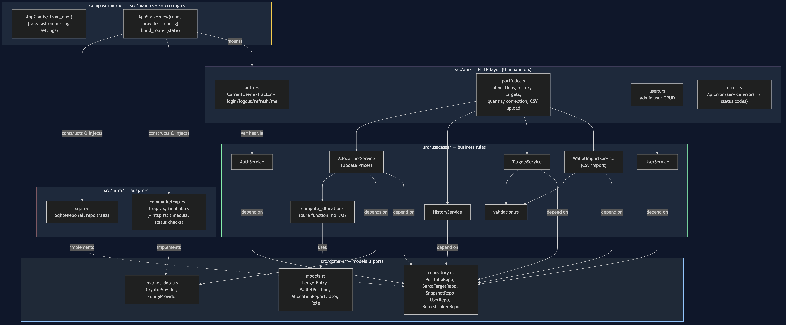
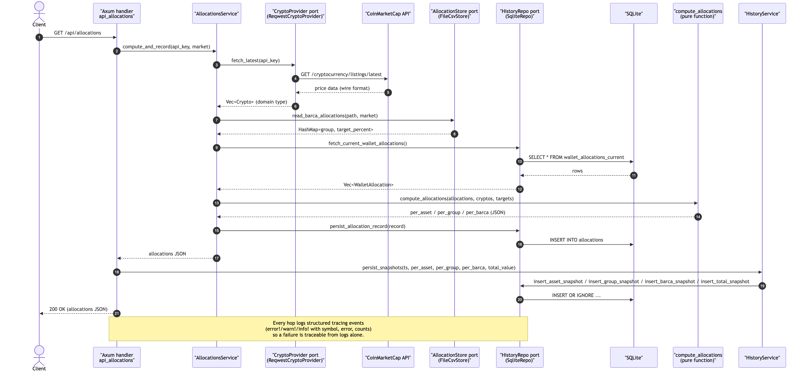
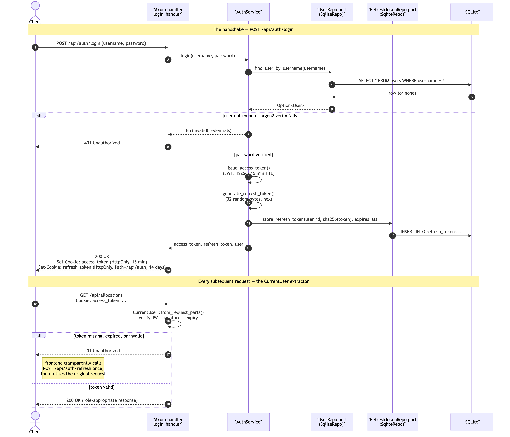
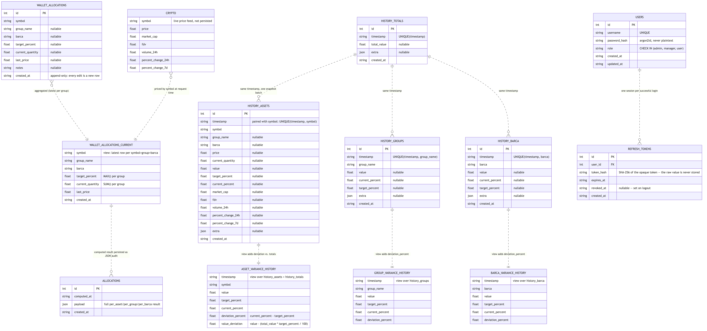

# Crypto Management Dashboard

A full-stack Rust + React dashboard for managing and visualizing your crypto wallet allocations.

---

## Features

- **Live Price Updates:** Fetches current prices and wallet values from CoinMarketCap.
- **Per-Asset Table:** View all assets with filters for Asset, Group, and BARCA. Includes pagination.
- **Per-Group Table:** See group allocations with current value ($), percent, deviation, and value deviation.
- **BARCA Actual Table:** View actual allocation per BARCA group.
- **Pie Charts:** Visualize allocations by Group and BARCA (target and actual) with readable labels.
- **Tabs:** Switch between tables and charts using tabs.
- **Responsive UI:** Built with Material UI and Recharts, with dark mode enabled.

---

## Architecture

The backend follows **ports-and-adapters** (a.k.a. hexagonal / clean architecture): business logic never talks to SQLite, CoinMarketCap, or the filesystem directly — it only talks to small traits, and concrete implementations of those traits are plugged in at startup. The goal is that any of those external systems (swap SQLite for Postgres, CoinMarketCap for another price feed) can be replaced without touching a single line of business logic.

Source: [`docs/architecture.mmd`](docs/architecture.mmd)



**Dependency direction always points inward**: `main` depends on `usecases` and `infra`; `usecases` depends only on `domain`; `infra` implements `domain`'s traits. Nothing in `domain/` or `usecases/` imports `sqlx` or `reqwest` — that's what makes the pure logic trivially unit-testable and the adapters swappable.

| Layer | Path | Responsibility |
|---|---|---|
| Domain | `src/domain/models.rs` | Plain structs shared across layers (`Crypto`, `WalletAllocation`, `User`, `Role`, snapshot rows). No logic, no I/O. |
| Domain (ports) | `src/domain/repository.rs`, `src/domain/market_data.rs` | Traits (`HistoryRepo`, `CryptoProvider`, `UserRepo`, `RefreshTokenRepo`) that `usecases` code against instead of concrete databases/APIs. |
| Use cases | `src/usecases/compute_allocations.rs` | Pure function: wallet + prices + targets in, per-asset/per-group/per-BARCA breakdown out. No I/O — the easiest thing in the codebase to unit test. |
| Use cases | `src/usecases/allocations_service.rs`, `src/usecases/history_service.rs` | Orchestrate ports to fetch prices, compute allocations, persist snapshots, and serve history — the application's actual behavior. |
| Use cases | `src/usecases/auth_service.rs`, `src/usecases/user_service.rs` | Password hashing (argon2id) + JWT issue/verify + login/refresh/logout; admin CRUD on user accounts. See [Authentication & Authorization](#authentication--authorization). |
| Infra (adapters) | `src/infra/sqlite/repo.rs` | One `SqliteRepo` implementing `HistoryRepo`, `UserRepo`, and `RefreshTokenRepo` against SQLite via `sqlx`. |
| Infra (adapters) | `src/infra/coinmarketcap.rs` | Implements `CryptoProvider` against the CoinMarketCap REST API; owns that API's wire format and maps it into the domain `Crypto` type. |
| HTTP glue | `src/auth_handlers.rs` | The `CurrentUser` Axum extractor (verifies the `access_token` cookie) and every `/api/auth/*` / `/api/admin/users*` handler — kept out of `main.rs` so it stays composition-root-sized. |
| Composition root | `src/main.rs` | Axum route handlers (thin — they just call into `usecases`), env/config loading, DB pool + migrations, CORS, and wiring the concrete adapters into `AppState` at startup. |
| Scripts | `src/bin/*.rs` | Standalone CLI utilities (CSV importer, historical price exporter) — deliberately separate from the server binary. |

### Sequence diagram: `GET /api/allocations`

This is the core workflow: fetch live prices, read the wallet and its targets, compute the allocation breakdown, persist it, and answer the request — with every hop logging structured `tracing` events so a failure anywhere is traceable from the logs alone.

Source: [`docs/sequence-allocations.mmd`](docs/sequence-allocations.mmd)



Every route above requires a valid `access_token` cookie — see the login handshake below for how that cookie gets there.

### Sequence diagram: the login handshake

Source: [`docs/sequence-login.mmd`](docs/sequence-login.mmd)



### Testing strategy

- **Unit tests** for `compute_allocations` (`src/usecases/compute_allocations.rs`) cover the happy path plus edge cases: unknown symbols, zero total value (division-by-zero guard), and duplicate wallet rows for the same asset aggregating correctly.
- **Unit tests** for `auth_service.rs` / `user_service.rs` cover password hashing (never stores or compares plaintext, two hashes of the same password differ), JWT round-tripping (wrong secret / garbage input rejected), refresh-token generation, and role validation on user create/update.
- **Repository tests** (`src/infra/sqlite/repo.rs`) run against a real in-memory SQLite database and the actual migrations, not a mock — verifying the SQL and the schema together, including the user/refresh-token tables (duplicate usernames rejected, partial updates only touch the fields passed, deleting a user clears their refresh tokens).
- **End-to-end integration tests** (`src/tests/integration.rs`) drive the real Axum router in-process, with fake `CryptoProvider`/`AllocationStore` implementations standing in for the network and the CSV file. One test performs a real login (POST credentials → real argon2 verify → real JWT issued → cookie extracted from the response) and then uses that cookie for every subsequent request, proving the whole handshake works end to end; another asserts the protected routes return 401 with no cookie at all.

Run everything with `cargo test`; `cargo clippy --all-targets` is kept warning-free.

### Known, intentional trade-offs

- The DB (`portfolio_targets`/`barca_targets` for config, the append-only `wallet_allocations` ledger for quantity history) is authoritative; `wallet_allocations.csv` is only a one-time seed for brand-new assets, never re-applied on top of existing data. This trades "one-file, no-tooling portfolio editing" for "safe concurrent edits with an audit trail and no silent overwrite risk" — the right call once the admin UI exists, even for a single-user dashboard.
- Allocations are computed synchronously per request rather than cached/pre-aggregated — simple and fine at this data volume; would need revisiting only if history tables or request volume grew by orders of magnitude.

## Data Model

`wallet_allocations` is the only hand-fed table (via the CSV importer); everything else is either a derived view or an append-only snapshot written by `/api/allocations`. SQLite has no `FOREIGN KEY` constraints anywhere in this schema — every relationship below is logical (joined by `symbol` or `timestamp` in a view or in application code), not enforced by the database, which is why they're drawn as dotted lines.

Source: [`docs/data-model.mmd`](docs/data-model.mmd)



- **`wallet_allocations`** — append-only ledger fed by `import_wallet_allocations` from `wallet_allocations.csv`; every edit is a new row, never an update.
- **`wallet_allocations_current`** (view) — aggregates the latest row per `(symbol, group_name, barca)`, summing `current_quantity` across ledger entries (e.g. the same coin held on two exchanges).
- **`CRYPTO`** — live market data from CoinMarketCap; never persisted directly, only joined by `symbol` against `wallet_allocations_current` at request time inside `compute_allocations`.
- **`history_assets` / `history_groups` / `history_barca` / `history_totals`** — one snapshot batch per `timestamp`, written together by `HistoryService::persist_snapshots` every time `/api/allocations` runs.
- **`asset_variance_history` / `group_variance_history` / `barca_variance_history`** (views) — add `deviation_percent` (and, for assets, `value_deviation`) on top of the raw snapshots; these are what `/api/history` actually serves.
- **`allocations`** — audit trail of the full computed JSON payload per run, independent of the per-row snapshots.
- **`users`** — one row per account (`username`, an argon2id `password_hash`, and a `role` of `admin`/`manager`/`user`). No public sign-up endpoint exists anywhere — every row is created by an Admin via the Admin tab, except the one bootstrap Admin seeded from env vars on first boot.
- **`refresh_tokens`** — one row per login. Stores only a SHA-256 hash of the opaque token the client actually holds, so a database leak alone can't be used to forge a session; `revoked_at` is set on logout.

---

## Authentication & Authorization

Three fixed roles, checked with a plain rank comparison (`Admin > Manager > User`) — no policy engine, no external identity provider, nothing beyond what a single-digit-user app actually needs:

| Role | Can do |
|---|---|
| **User** | View allocations, per-group/BARCA tables, and the history dashboard. |
| **Manager** | Everything User can, plus import a wallet CSV (`POST /api/import_wallets`). |
| **Admin** | Everything Manager can, plus create/edit/delete user accounts (`/api/admin/users*`). |

- **Session**: a short-lived (15 min) JWT access token plus a longer-lived (14 day) opaque refresh token, both `HttpOnly`/`SameSite=Lax` cookies — never `localStorage`, which is readable by any injected script. The frontend's `api/client.js` transparently calls `/api/auth/refresh` once on a 401 and retries, so an expired access token never interrupts an active session.
- **Passwords**: `argon2id` via the `argon2` crate. Never compared or stored in plaintext.
- **No public registration**: every account is created by an Admin. The very first Admin is seeded from `ADMIN_USERNAME`/`ADMIN_PASSWORD`/`ADMIN_EMAIL` env vars on first boot, if the `users` table is empty and all three are set (see `ensure_admin_seeded` in `main.rs`).
- **CORS**: credentialed (cookie-carrying) requests can't use a wildcard origin — `FRONTEND_ORIGIN` must name the frontend's exact origin.
- **Deliberately not used**: no API gateway (Kong et al.) — that solves problems (routing across many services, centralizing auth for many teams) this single-binary, handful-of-users app doesn't have, and would add a second stateful service to operate and patch for no benefit here. If you outgrow this, a lightweight reverse proxy (Caddy, for automatic HTTPS) or a perimeter layer (Cloudflare Tunnel + Access, useful specifically for secure remote/mobile access without opening an inbound port) are the right next steps — not a gateway.

Required env vars (see `.env.example`): `JWT_SECRET` (generate with `openssl rand -hex 32`), `ADMIN_USERNAME`, `ADMIN_PASSWORD`, `ADMIN_EMAIL`, `FRONTEND_ORIGIN`, `COOKIE_SECURE` (set to `true` once served over HTTPS).

---

## Prerequisites

- [Rust](https://www.rust-lang.org/tools/install)
- [Node.js & npm](https://nodejs.org/)
- A [CoinMarketCap](https://coinmarketcap.com/api/) API key — **required**, crypto pricing is always on.
- A [brapi.dev](https://brapi.dev) API key — optional, only needed once you track a `br-equities` asset (e.g. HGRU11, XPML11).
- A [Finnhub](https://finnhub.io) API key — optional, only needed once you track a `us-indices` asset.

---

## Backend (Rust) Setup

1. **Clone the repository and enter the project directory:**

   ```sh
   git clone <your-repo-url>
   cd crypto_management
   ```

2. **Set up your environment variables:**

   Copy `.env.example` to `.env` and fill it in:

   ```sh
   cp .env.example .env
   ```

   - `API_KEY`: Your CoinMarketCap API key (required).
   - `BRAPI_API_KEY`, `FINNHUB_API_KEY`: optional — leave the placeholder values if you're not tracking `br-equities`/`us-indices` assets yet; nothing breaks, those providers just aren't called.
   - `CURRENT_MARKET`: which BARCA target profile is active (`BullMarket` or `BearMarket` — see [BARCA targets](#editable-portfolio-and-barca-targets) below). Every `barca_targets` row belongs to exactly one profile; there's no fallback between them.
   - `DATABASE_URL`: defaults to `sqlite://./data/crypto.db` if unset — no need to set this for local dev.
   - `JWT_SECRET`, `ADMIN_USERNAME`, `ADMIN_PASSWORD`, `ADMIN_EMAIL`, `FRONTEND_ORIGIN`, `COOKIE_SECURE`: see [Authentication & Authorization](#authentication--authorization) — all required (the three `ADMIN_*` vars must be set together, or no bootstrap admin is created and you'll have no way to log in).

3. **Prepare your wallet allocations file (optional — only needed to seed your very first assets):**

   Edit or create `wallet_allocations.csv` in the project root. This is a **one-time seed**, not a live source of truth — see [Editable portfolio & BARCA targets](#editable-portfolio-and-barca-targets) below. Example:

   ```
   symbol,group,barca,target_percent,current_quantity,asset_class
   USDT,Caixa,Caixa,30,1200,crypto
   BTC,Holding,Hodl,10,0.75,crypto
   ETH,Holding,Hodl,10,2.5,crypto
   HGRU11,FII,Renda Variavel,5,10,br-equities
   ```

   `asset_class` is optional and defaults to `crypto` if the column is omitted; it's one of `crypto` / `br-equities` / `us-indices` and controls which price provider is used for that symbol when you click **Update Prices**.

4. **Build and run the backend server:**

   ```sh
   cargo run --bin crypto_management
   ```

   (`cargo run` alone also works, since `crypto_management` is the default binary — but this repo also has extractor/importer binaries in `src/bin/`, so use `--bin crypto_management` if you want to be explicit about starting the server.)

   The backend will start at [http://127.0.0.1:3001](http://127.0.0.1:3001). On startup it:
   - connects to SQLite at `DATABASE_URL` (a fresh file is created automatically if it doesn't exist — no manual `sqlite3`/`mkdir` step needed),
   - runs every pending migration in `migrations/` automatically (`sqlx::migrate!`), and
   - seeds `wallet_allocations` from your CSV **only if the table is completely empty**, and bootstraps the Admin account from `ADMIN_USERNAME`/`ADMIN_PASSWORD`/`ADMIN_EMAIL` **only if the `users` table is completely empty** — both are safe to re-run on every boot, they're no-ops once you have real data.

   You should see `Migrations applied` and `Listening on 127.0.0.1:3001` in the logs. If you add a new file under `migrations/` yourself, force a real rebuild before the next `cargo run` (e.g. `touch src/main.rs`) — `sqlx::migrate!` embeds migrations at compile time, and cargo doesn't always detect that a `.sql`-only change needs a rebuild, so a stale binary can silently skip it.

   To manually re-import the CSV later (e.g. to seed a newly-added asset — this never overwrites an existing DB row, see [below](#editable-portfolio-and-barca-targets)):
   - CLI: `cargo run --bin import_wallet_allocations -- wallet_allocations.csv`
   - UI: click **Import Wallet CSV** in the header (Manager+ only).

5. **Test the API:**

   Every route requires a login first — the bootstrap Admin from your `.env`:

   ```sh
   curl -c cookies.txt -X POST http://127.0.0.1:3001/api/auth/login \
     -H "Content-Type: application/json" \
     -d '{"username":"'"$ADMIN_USERNAME"'","password":"'"$ADMIN_PASSWORD"'"}'

   curl -b cookies.txt http://127.0.0.1:3001/api/allocations
   ```

   Visiting [http://127.0.0.1:3001/api/allocations](http://127.0.0.1:3001/api/allocations) directly in a browser tab will return `401` — there's no session cookie without going through the frontend's login page or the `curl` handshake above.

---

## Frontend (React) Setup

1. **Navigate to the frontend directory:**

   ```sh
   cd frontend
   ```

2. **Install dependencies:**

   ```sh
   npm install
   ```

3. **Start the React development server:**

   ```sh
   npm run dev
   ```

   The frontend will be available at [http://localhost:5173](http://localhost:5173) (or the port shown in your terminal).

4. **Log in.** Open the frontend URL — you'll land on the login page. Sign in with the `ADMIN_USERNAME`/`ADMIN_PASSWORD` from your `.env` (that account was bootstrapped when the backend first started, see step 4 above). There's no self-registration anywhere in the app; every other account is created from the Admin tab once you're logged in.

---

## Usage

With both the backend and frontend running and you logged in:

- Click **Update Prices** in the header to fetch live prices (CoinMarketCap always; brapi/Finnhub too, for any `br-equities`/`us-indices` assets you're tracking) and recompute your allocation. This is the only thing that triggers a price fetch — no polling, no background jobs.
- **Per-Asset / Per-Asset Total / Per-Group / BARCA Actual** tabs show the computed breakdown, with deviation from target highlighted.
- The **Dashboard** tab plots the persisted history (every `Update Prices` click appends a snapshot).
- **Portfolio Targets** and **BARCA Targets** tabs (Manager+) are where you actually manage your portfolio day to day — see the next section. `wallet_allocations.csv` is only a one-time seed, not something you keep editing.
- **Admin** tab (Admin only) manages user accounts (create, change role, reset password, delete).

### Editable portfolio and BARCA targets

Once you have data, the DB — not the CSV — is authoritative:

- **Portfolio Targets** tab: one editable row per asset (symbol, group, BARCA, asset class, target %). Quantity/notes are read-only here (they come from CSV import / ledger history, to avoid a whole class of double-counting bugs from mixing "edit a target" with "edit a ledger") — add a brand-new asset via **+ Add Asset** to give it a starting quantity. The BARCA/Group columns suggest existing values (to avoid typos) but accept a new one too.
- **BARCA Targets** tab: one editable row per BARCA bucket (e.g. "Base", "Altcoins", or a new one like "IBOVE") for the market profile selected in the dropdown (`BullMarket`/`BearMarket`, matching `CURRENT_MARKET`). A bucket only applies to the market it's saved under — add it to both if it should always be active.
- Both tabs share the same pattern: edit the table, a single **Save All** button submits the whole set atomically, and target percentages across the set must sum to exactly 100% or the save is rejected client- and server-side.
- Re-importing the CSV (manually, or the automatic empty-DB seed) never overwrites an existing row — it only inserts symbols/targets that don't already exist yet.

### Manually re-importing the CSV

```bash
cargo run --bin import_wallet_allocations -- wallet_allocations.csv
```

Inserts a ledger row (and a `portfolio_targets` seed row) only for `(symbol, group, barca, asset_class)` combinations not already in the DB. Inspect current values with:

```bash
sqlite3 ./data/crypto.db "SELECT * FROM wallet_allocations_current;"
```

---

## Troubleshooting

- **CORS / cookie errors:**  
  `FRONTEND_ORIGIN` must exactly match the origin the frontend is actually served from (protocol + host + port). Credentialed requests can't use a wildcard origin, so a mismatch here shows up as the browser silently dropping the session cookie rather than a visible CORS error.

- **401 on every request after logging in:**  
  Check `JWT_SECRET` is set and unchanged since login (changing it invalidates every existing session), and that `COOKIE_SECURE` matches how you're actually serving the app (`false` over plain HTTP, `true` over HTTPS — browsers silently drop `Secure` cookies over HTTP).

- **API key errors:**  
  Make sure `.env` has a valid CoinMarketCap `API_KEY` (required) and `CURRENT_MARKET`. `BRAPI_API_KEY`/`FINNHUB_API_KEY` only matter once you track a `br-equities`/`us-indices` asset — until then they're never called, so a placeholder value there is harmless.

- **No admin account / can't log in on first boot:**  
  `ensure_admin_seeded` only bootstraps an Admin if `ADMIN_USERNAME`, `ADMIN_PASSWORD`, and `ADMIN_EMAIL` are **all three** set — check the startup logs for a warning if one's missing.

- **A migration you just added doesn't seem to have run:**  
  See the note in [Backend Setup](#backend-rust-setup) about forcing a rebuild (`touch src/main.rs`) — `cargo run` can silently reuse a binary compiled before a new `migrations/*.sql` file existed. Confirm with `sqlite3 ./data/crypto.db "SELECT version FROM _sqlx_migrations ORDER BY version DESC LIMIT 1;"`.

- **Dependency issues:**  
  Run `cargo update` in the backend and `npm install` in the frontend if you encounter build errors.

---

## Customization

- The frontend uses Material UI with a dark theme.  
  You can further customize the look in `frontend/src/theme.js`.
- Your portfolio lives in the DB (`portfolio_targets` + `wallet_allocations`), edited via the **Portfolio Targets**/**BARCA Targets** tabs — see [Editable portfolio and BARCA targets](#editable-portfolio-and-barca-targets). `wallet_allocations.csv` is only a one-time seed for brand-new assets.

---

## History API & Dashboard Data

Every time `/api/allocations` runs (e.g., when you click **Update Prices**) the backend persists the computed snapshot directly into SQLite:

- `history_assets` receives one row per asset (with target %, current %, deviation %, and USD value deviation computed in the database).
- `history_groups` stores the per-group view that powers both the table and the dashboard.
- `history_barca` and `history_totals` keep BARCA-level and total wallet timelines.
- The derived views `asset_variance_history`, `group_variance_history`, and `barca_variance_history` are what `/api/history` serves to the frontend.

API:
- `GET /api/allocations` — computes the latest allocation, persists the snapshot, and returns the live tables/charts.
- `GET /api/history?level={totals|assets|barca|groups}` — streams the historical rows for the requested level. Assets and BARCA entries now include `deviation` and `value_deviation` fields for the variance dashboard.

Example:

```bash
curl -sS "http://127.0.0.1:3001/api/history?level=assets" | jq .
```

The frontend dashboard tab uses these APIs (with optional period bucketing) to plot totals, BARCA groups, asset symbols, or the new per-group series.

## CSV vs. DB responsibilities

The DB is authoritative once it has data — `wallet_allocations.csv` only seeds brand-new `(symbol, group, barca, asset_class)` combinations that don't already exist (via the automatic empty-DB seed on first boot, or a manual re-import), and never overwrites an existing row. Ongoing edits happen in the app itself: `target_percent` lives in the mutable `portfolio_targets`/`barca_targets` tables (edited via the Portfolio Targets/BARCA Targets tabs, see [above](#editable-portfolio-and-barca-targets)), and quantity/notes live in the append-only `wallet_allocations` ledger (updated by CSV import or, for a brand-new asset, the Portfolio Targets tab's "+ Add Asset"). See [Architecture](#architecture) for how the pieces fit together.


## License

MIT

---
