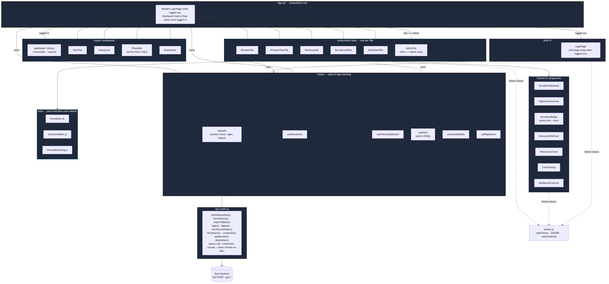

# Frontend

React 19 + MUI + Recharts single-page app for the Wallet Allocations dashboard. For project-wide setup (backend, database, running both halves together), see the [root README](../README.md#frontend-react-setup).

```bash
npm install
npm run dev      # start the dev server
npm run test     # run the Vitest suite
npm run lint     # eslint
npm run build    # production build
```

Copy `.env.example` to `.env.local` if the backend isn't running on the default `http://localhost:3001`.

---

## Architecture

`App.jsx` is a thin composition root — it renders `LoginPage` while logged out, or the dashboard (tab/filter state and derived totals) once `useAuth` resolves a session. No business logic lives in a component: table math is in `utils/`, data fetching is in `hooks/`, and styling tokens are in `theme.js`.

Source: [`docs/architecture.mmd`](docs/architecture.mmd)



### Key components structure

| Layer | Path | Responsibility |
|---|---|---|
| Composition root | `src/App.jsx` | Tab/filter state, derived totals (`filteredAllocations`, `symbolAllocations`), and wiring everything else together. Nothing here renders a table row directly. |
| Auth UI | `src/components/LoginPage.jsx` | Full-page swap shown whenever there's no session — there's no router, so "logged out" is just a different thing `App.jsx` renders. |
| Layout | `src/components/AppHeader.jsx`, `ActionsBar.jsx`, `StatTiles.jsx`, `StatusLine.jsx`, `FiltersBar.jsx`, `EmptyState.jsx` | The page chrome: sticky header (identity + Log Out), KPI tiles, filter chips, empty/loading affordances. |
| Tabs | `src/components/tabs/*.jsx` | One component per tab (`PerAssetTab`, `PerAssetTotalTab`, `PerGroupTab`, `BarcaActualTab`, `DashboardTab`, `AdminTab`). Each owns its own table/chart composition and pulls in whichever hooks/utils it needs. `AdminTab` only renders when `role === "admin"`. |
| Shared UI | `src/components/{SortableTableHead,PaginationControls,DeviationBadge,AllocationPieChart,HistoryLineChart,ChartTooltip,DashboardControls}.jsx` | Reusable pieces used by more than one tab — a generic sortable header, pagination controls, the colored-dot deviation indicator, and the two chart wrappers. |
| Hooks | `src/hooks/{useAuth,useAllocations,useHistoryDashboard,useUsers,useSortableData,usePagination}.js` | All `useState`/`useEffect`/data-fetching. `useAuth` owns the session (checks it on mount, exposes `login`/`logout`); `useUsers` is `AdminTab`'s CRUD. `useSortableData` and `usePagination` are generic — every table reuses the same two hooks instead of hand-rolling sort/paging logic per table. |
| Utils | `src/utils/{formatters,allocationMath,historyBucketing}.js` | Pure functions only — no React, no DOM. This is 100% of what's unit-tested (`*.test.js` next to each file). |
| API | `src/api/client.js` | The only place that calls `fetch()`. Every call sets `credentials: "include"` (so the session cookie is sent) and transparently retries once via `/api/auth/refresh` on a 401. `VITE_API_BASE_URL` (see `.env.example`) points it at the backend. |
| Theme | `src/theme.js` | The dark MUI theme, the fixed 8-color categorical palette, and `colorForSeries()` — see [Design system](#design-system) below. |

### Testing

Vitest + React Testing Library. Pure logic in `utils/`, `theme.js`'s `colorForSeries`, and all six hooks (including `useAuth` and `useUsers`, with the backend mocked) have direct unit tests; `PaginationControls`, `LoginPage`, and `AdminTab` have component tests exercising real interaction (typing, clicking, confirming a delete). Run with `npm run test`. There's no end-to-end browser test — the golden path and edge cases (login, role-gated UI, filters, sorting, pagination, CSV import, all 6 tabs, both chart types) are verified manually against a running backend before every change of this size.

---

## Authentication

There's no router and no self-registration — `App.jsx` just renders `LoginPage` instead of the dashboard whenever `useAuth`'s session check comes back empty, and `AdminTab` only renders as a 6th tab when the logged-in user's role is `admin`. See the root README's [Authentication & Authorization](../README.md#authentication--authorization) for the backend side of the handshake and the full sequence diagram.

- The session lives in `HttpOnly` cookies the browser manages automatically — the frontend never reads or stores a token itself.
- `ActionsBar` hides (not just disables) "Import Wallet CSV" for the `user` role, so the permission boundary is visible rather than a button that would just 403.
- An expired access token is invisible to the rest of the app: `api/client.js` retries once through `/api/auth/refresh` before surfacing any error.

---

## Design system

The UI follows a validated dark-theme palette rather than MUI's stock `mode: "dark"` defaults — see `theme.js` for the full token set.

- **Categorical color is fixed-order, not cycled by array index.** `colorForSeries(name, allSeries)` resolves a color from an entity's position in the *full* sorted series list, not its position in whatever subset is currently selected/filtered — so removing a filter never repaints the series that survive it.
- **Status colors (`good`/`warning`/`critical`) are reserved** for deviation severity (`DeviationBadge`) and never reused as a chart series color, so a red line and a "critical deviation" cell never look like the same signal.
- **Known trade-off**: the fixed palette has 8 hues. With ~30 possible assets, an arbitrary 5-series default (see below) can occasionally repeat a color. This is an accepted limit of a fixed categorical palette, not a bug — narrow the Dashboard's Series picker to avoid it when it matters.
- **The Dashboard's "Assets"/"BARCA"/"Groups" levels default to the top 5 series by value**, not every series — a line chart with 30 overlapping series is unreadable regardless of color choice; the multi-select still allows picking any subset.
- Numeric table columns use `font-variant-numeric: tabular-nums` so digits align vertically down a column.
- A deviation reading is never color-only: `DeviationBadge` always pairs the color with a visible dot and the text itself, for colorblind-safe reading.
